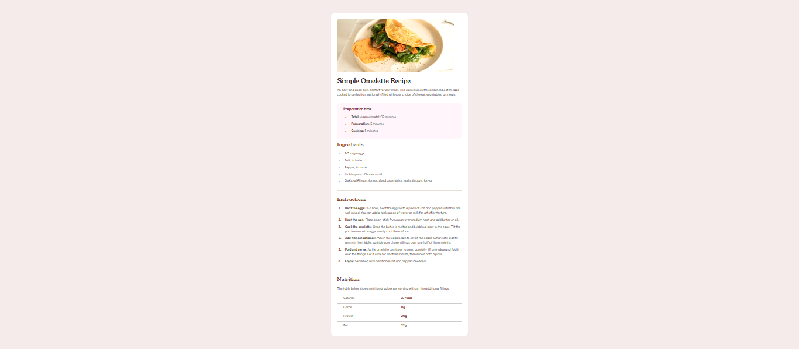

# Frontend Mentor - Recipe page solution

This is a solution to the [Recipe page challenge on Frontend Mentor](https://www.frontendmentor.io/challenges/recipe-page-KiTsR8QQKm). Frontend Mentor challenges help you improve your coding skills by building realistic projects.

## Table of contents

- [Overview](#overview)
  - [The challenge](#the-challenge)
  - [Screenshot](#screenshot)
  - [Links](#links)
- [My process](#my-process)
  - [Built with](#built-with)
  - [What I learned](#what-i-learned)
  - [Continued development](#continued-development)
  - [Useful resources](#useful-resources)

## Overview

### The challenge

The challenge was to build out this recipe page and get it looking as close to the design as possible. The dask was also to make this page adaptive for both mobile and desktop sizes.

### Screenshot



### Links

- Solution URL: [Add solution URL here](https://your-solution-url.com)

## My process

### Built with

- Semantic HTML5 markup
- CSS custom properties
- Flexbox

### What I learned

This challenge made me focus on writing semantic HTML. I also had to apply a lot of different CSS properties to make it look right.

I learned how to apply a filter to adjust the brightness of the image.

```css
filter: brightness(105%);
```

Also first time that I applied nth-child pseudo-class to my project:

```css
td:nth-child(2) {
  color: var(--clr-brown800);
  font-weight: var(--fw-bold);
  padding-left: 0.5em;
}
td:nth-child(1) {
  padding-left: 2em;
  width: 50%;
  box-sizing: border-box;
}
```

### Continued development

In future projects I want to explore media queries to adjust styles based on different screen sizes for a fully adaptive layout.

### Useful resources

- [CSS :nth-child() Pseudo-class](https://www.w3schools.com/cssref/sel_nth-child.php) - This helped me with use of :nth-child() Pseudo-class .
